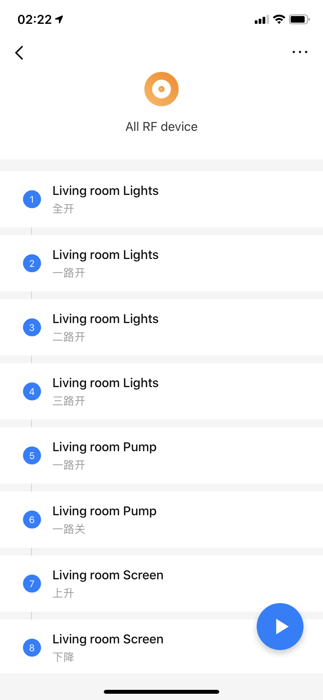
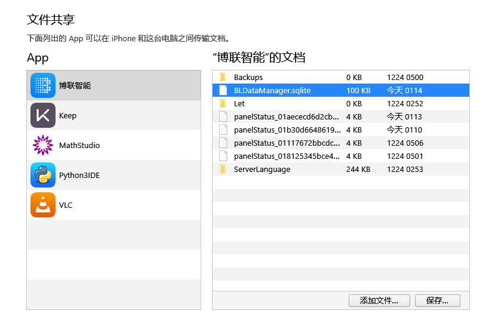

# Extract Broadlink IR/RF codes from iOS App

> 博联RM Pro+智能遥控，学习到的红外/射频码的，最简单获取方式。

- I want fxxk Broadlink first, for waste me so many time in learning RF code.
- And I accidentally found a very convenient method to get these codes.
- It works for me, and hope it helps you.

## 1. Create scene contains all commands

> 建一个新场景，把你想要获取的射频码的命令都加进去。

- Create a scene in `BroadLink App` ([this one](https://apps.apple.com/us/app/broadlink/id1450257910)), my version is 1.2.3 from appstore Japan.
- Created `ALL RF Devices', and please add all the commands you need.  
   

## 2. Get database with iTunes

> 从 iTunes 里取出 `BLDataManager.sqlite` 这个文件。

- Open your iTunes, and connect your phone.
- In file sharing, find `BroadLink` App, and save `BLDataManager.sqlite` to your disk.  
   

## 3. Extract all codes by python

> 把 `BLDataManager.sqlite` 放到 `extract_codes.py` 同目录，然后运行这个 python 文件。  
> 就是打开命令行，进入该目录，输入 `python extract_codes.py`。  
> 结果会保存为 `codes.txt` 。

- Put `BLDataManager.sqlite` in the same folder as `extract_codes.py`, and run it. It's python3.
- Then it will auto save a `codes.txt` in the same folder, contains all the codes converted into base64.

```bash
python extract_codes.py
# or pass the sqlite file path explicitly
python extract_codes.py /path/to/BLDataManager.sqlite
```

## It's not perfect

> 在 `codes.txt` 里，应该能比较容易地找到相关命令。  
> 如果你设备很多的话，可能需要猜一下。因为我没有把设备码转换为名称，因为那样需要读取更多表，比较复杂。
>
> 最后希望这些硬件厂商尽量开放接口，不要闭门造车，重复造轮子。试图圈地做平台服务（虽然现在的App已经好了很多），最终很难赢过大厂。推广运营等等，有很多超出既有经验的挑战。做好本业，软件部分尽量开放，借众人力以制衡，好过自己硬扛。

- And in the `codes.txt`, you can identify commands by `name` & `func`, because I can not translate `device id` to `device name` without reading more tables.
- Hope this helps, and good luck!
