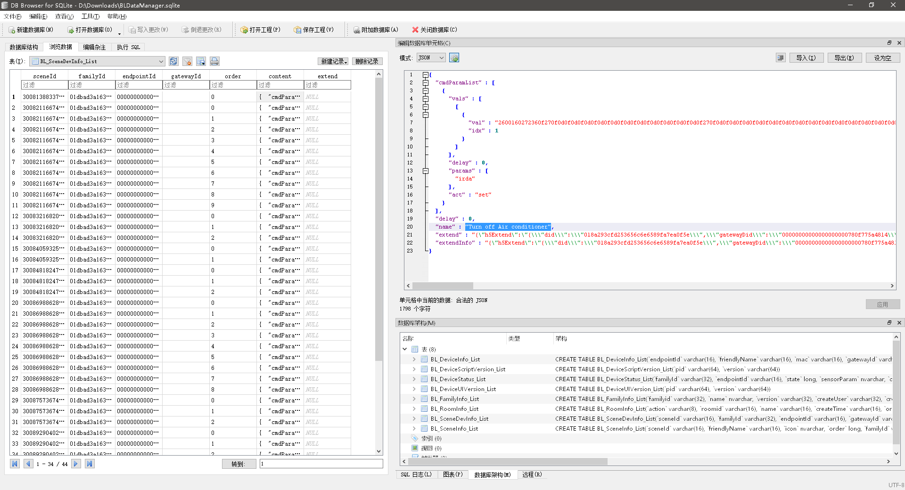

# Extract Broadlink IR/RF codes from iOS App

> 博联RM Pro+智能遥控，学习到的红外/射频码的，最简单获取方式。

- I want fxxk Broadlink first, for waste me so many time in learning RF code.
- And I accidentally found a very convenient method to get these codes.
- It works for me, and hope it helps you.

## 1. Create scene contains all commands

> 建一个新场景，把你想要获取的射频码的命令都加进去。  

- Create a scene in `BroadLink App` ([this one](https://apps.apple.com/us/app/broadlink/id1450257910)), my version is 1.2.3 from appstore Japan.
- Created `ALL RF Devices', and please add all the commands you need.    
    

## 2. Get database with iTunes 

> 从 iTunes 里取出 `BLDataManager.sqlite` 这个文件。

- Open your iTunes, and connect your phone.
- In file sharing, find `BroadLink` App, and save `BLDataManager.sqlite` to your disk.    
    

## 3. Read database and find YOUR codes

> 找一个 sqlite 的工具看一下 `BL_SceneDevInfo_List` 这个表，场景中的命令就都在这里面。

- Yes, the codes should belong to you, not BroadLink only. (I am really mad about it.)
- Fine, you can open it with some sqlite GUI, I used [DB Browser for SQLite](https://sqlitebrowser.org/).
- In `BL_SceneDevInfo_List`, the `content` column contains all the codes we need.
- But just the commands what added to `Scene` (in step 1) contains. (Here contains all the scenes, but maybe some command not belong to any scene, so I add them in step 1.)  
- If you only need a few pieces of code, you can copy and convert it to base64.  
    

## 4. Extract all codes by python

> 把 `BL_SceneDevInfo_List` 导出为 json 文件。  
> 然后放在 `extract_codes.py` 同目录，然后运行这个 python 文件。  
> 就是打开命令行，进入该目录，输入 `python extract_codes.py`。  
> 结果会保存为 `codes.txt` 。

- Export the `BL_SceneDevInfo_List` to a json file, I've shared mine as a sample.
- And run the python file `extract_codes.py`, make sure this two files are in same folder. And it's python3.
- Then it will auto save a `codes.txt` in save folder, contains all the codes, converted into base64. You can directly test it in hass service.

## It's not perfect

> 在 `codes.txt` 里，应该能比较容易地找到相关命令。  
> 如果你设备很多的话，可能需要猜一下。因为我没有把设备码转换为名称，因为那样需要导出更多表，比较复杂。而我也不想共享整个数据库，因为里面可能会含有敏感信息。  
> 
> 最后希望这些硬件厂商尽量开放接口，不要闭门造车，重复造轮子。试图圈地做平台服务（虽然现在的App已经好了很多），最终很难赢过大厂。推广运营等等，有很多超出既有经验的挑战。做好本业，软件部分尽量开放，借众人力以制衡，好过自己硬扛。

- I don't want share all my database, so we operate a exported json file. (Hope there is nothing sensitive in it.)
- And in the `codes.txt`, you can identify commands by `name` & `func`, because I can not translate `device id` to `device name`, it need whole database or export more json, forget it please.
- In sample files, many name display in Chinese, but that should not cause trouble, right?
- Hope this helps, and good luck!
